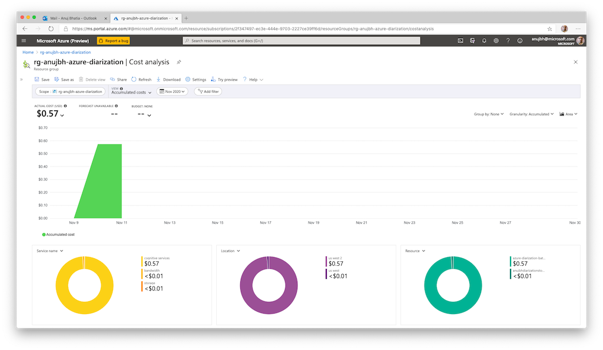

# Podcast Transcription/Diarization 🔈

This sample that will take the [Invest like the Best Podcast](https://investorfieldguide.com/podcast/) and transcribe it using [Azure Batch Speaker diarization](https://docs.microsoft.com/en-us/azure/cognitive-services/speech-service/batch-transcription#speaker-separation-diarization) into the following format:

```javascript
{
    "transcription_result": [
        {
            "speaker" : "1",
            "words" : "hello and welcome everyone i'm patrick o'shaughnessy and this is invest like the best...",
            "confidence": 0.881108
        }
        {
            "speaker" : "2",
            "words" : "There's no good answer, but there are definite good fit answers, so...",
            "confidence": 0.5449745
        }
    ]
}
```

## ✅ Requirements

- [Azure CLI](https://docs.microsoft.com/en-us/cli/azure/install-azure-cli)
- [Python 3.8.x](https://www.python.org/downloads/)
- [HomeBrew](https://brew.sh/)
- [Swagger CodeGen](https://github.com/swagger-api/swagger-codegen)
- [Jupyter + VS Code](https://code.visualstudio.com/docs/python/jupyter-support)
- [Azure Speech Services](https://docs.microsoft.com/en-us/azure/cognitive-services/speech-service/)


## 🎯 Getting started

Run the following commands (also in the Jupyter notebook) to install the necessary dependencies:

pip install -r requirements.txt
!pip install ./python-client

## Usage

- Open the Juptyer notebook in VS Code.
- Run the setup scripts to create the resources in Azure
- Download a sample podcast audio file or provide your own
- Upload and submit the transcription to the default Azure Speech Model for transcription + diarization

## TODO:

- Generate swagger-codegen client programatically
- Output formatted speaker sentence fragments


## Discussion

### Cost

Azure Speech prices [Conversation Transcription](https://azure.microsoft.com/en-us/pricing/details/cognitive-services/speech-services/) at $2.10/hour of audio. For a roughly 1 hour single channel audio file we were able to achieve transcription and diarization for roughly $0.57 USD including storage and networking costs.

<p align="center">

</p>
### Output Formatting 
By default. Batch transcription diarization outputs a complex [transcription diarization result](https://docs.microsoft.com/en-us/azure/cognitive-services/speech-service/batch-transcription#batch-transcription-result)

In future versions of this sample we will try to process the diarized result into sentence level fragments based on the speaker object.

```javascript
    {
      "recognitionStatus": "Success",
      "channel": 0,
      "speaker": 1,
      "offset": "PT3.86S",
      "duration": "PT17.17S",
      "offsetInTicks": 38600000.0,
      "durationInTicks": 171700000.0,
      "nBest": [
        {
          "confidence": 0.853557646,
          "lexical": "hello and welcome everyone i'm patrick o'shaughnessy and this is invest like the best...",
          "itn": "hello and welcome everyone i'm patrick o'shaughnessy and this is invest like the best...",
          "display": "Hello and welcome everyone. I'm Patrick O'Shaughnessy and this is invest like the best...",
          "words": [
            {
              "word": "hello",
              "offset": "PT3.86S",
              "duration": "PT0.58S",
              "offsetInTicks": 38600000.0,
              "durationInTicks": 5800000.0,
              "confidence": 0.881108
            },
            {
              "word": "and",
              "offset": "PT4.44S",
              "duration": "PT0.1S",
              "offsetInTicks": 44400000.0,
              "durationInTicks": 1000000.0,
              "confidence": 0.840485
            },
            {
              "word": "welcome",
              "offset": "PT4.54S",
              "duration": "PT0.36S",
              "offsetInTicks": 45400000.0,
              "durationInTicks": 3600000.0,
              "confidence": 0.848263
            },
```

## License

Apache 2.0